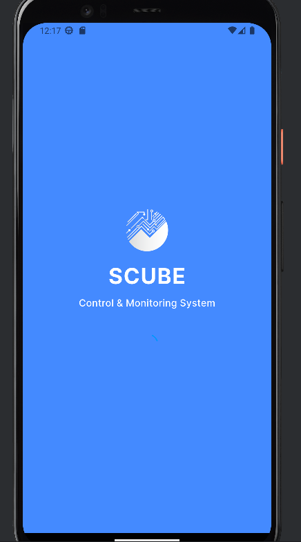
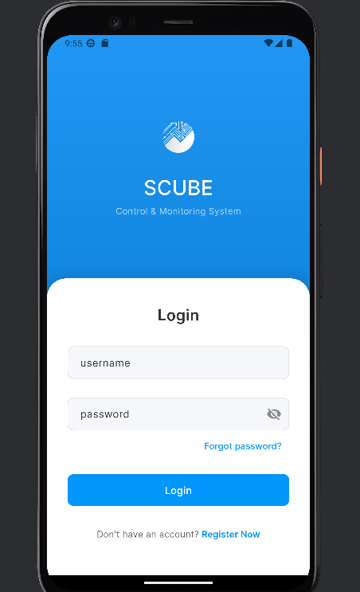
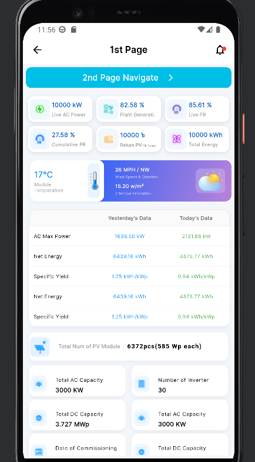
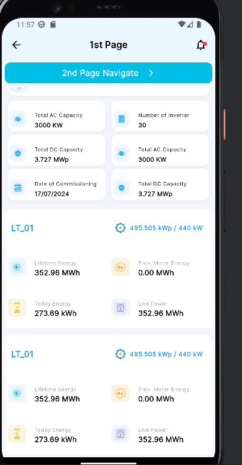
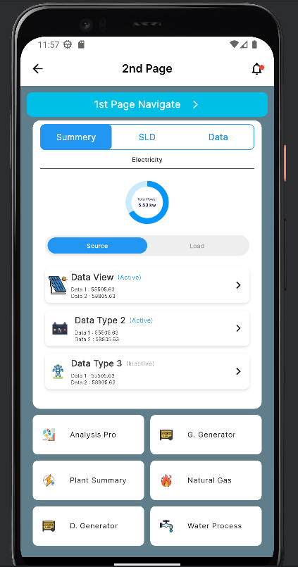

# Scube Monitoring Flutter App

A Flutter-based mobile application for monitoring PV (Photovoltaic) systems in real-time. The app provides live data of energy generation, AC/DC capacity, module temperatures, wind speed, and other essential metrics for PV systems.  

The app is designed with a modern, responsive UI for both Android and iOS devices.

---

## Features

- **Dashboard View**: Displays key system metrics like live AC power, plant generation, PR (Performance Ratio), cumulative PR, total energy, and returns.
- **Temperature & Sun/Moon Tiles**: Dynamic weather and PV module temperature information depending on the current time slot.
- **Data Table**: Shows yesterday's and today's PV system performance metrics in a tabular format.
- **PV System Information**: Lists complete system information including AC/DC capacity, number of inverters, total PV modules, and commissioning date.
- **Detailed PV System Data**: Energy statistics including lifetime energy, today's energy, live power, and previous meter energy.
- **Multiple Screens**: Easy navigation between different pages for more detailed insights.

---

## Screenshots

| Splash Screen | Login Screen |
|---------------|-------------|
|  |  |

| First Page - Overview | First Page - Tiles |
|----------------------|------------------|
|  |  |

| Second Page |
|-------------|
|  |

---

## Installation

1. Clone the repository:

```bash
git clone https://github.com/abdulazizpatwary/scubeproject
